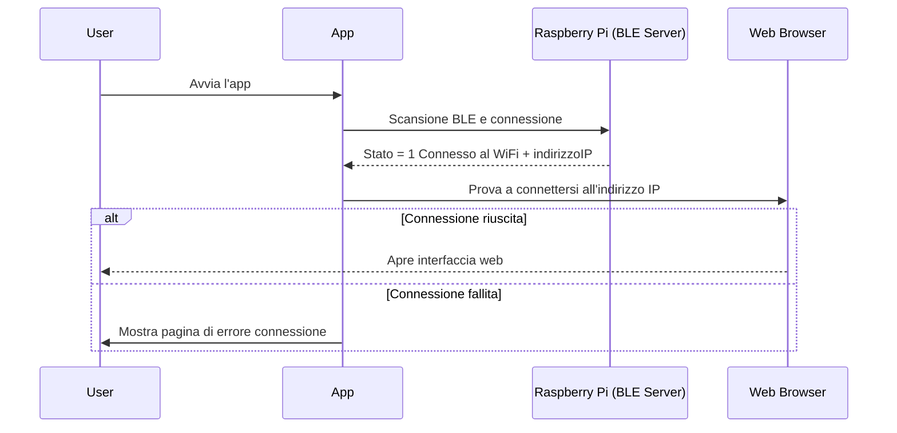
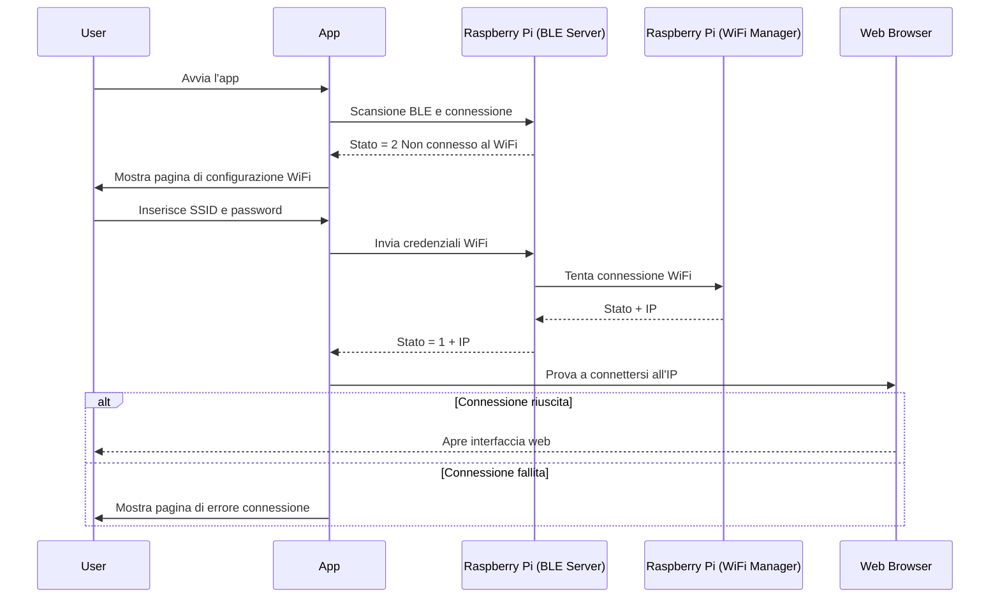
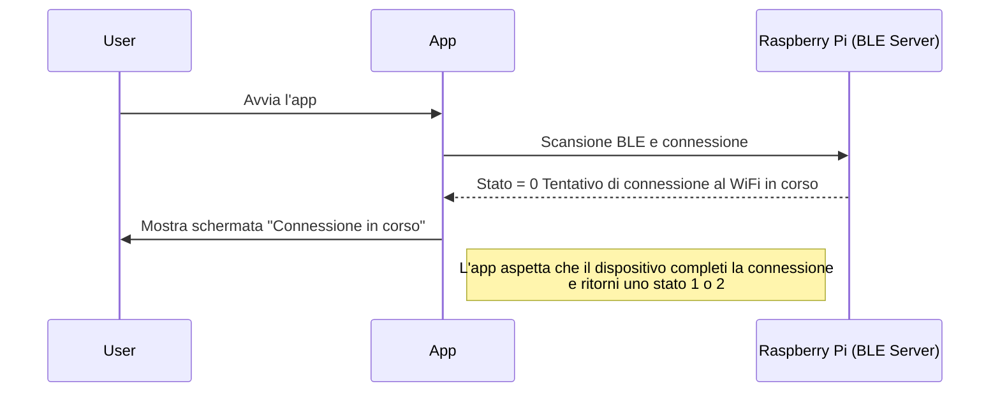
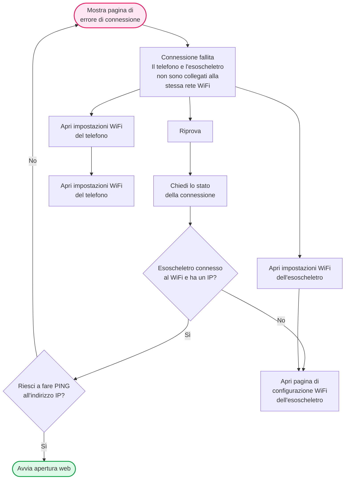

# Diagrammi di sequenza

#### User journey

```mermaid
sequenceDiagram
  participant User
  participant App
  participant BLE as Raspberry Pi (BLE Server)
  participant Browser as Web Browser

  User->>App: Avvia l'app
  App->>BLE: Scansione BLE e connessione
  BLE-->>App: Stato = 1 Connesso al WiFi +  indirizzoIP

  App->>Browser: Prova a connettersi all'indirizzo IP
  alt Connessione riuscita
    Browser-->>User: Apre interfaccia web
  else Connessione fallita
    App->>User: Mostra pagina di errore connessione
  end
```

```mermaid
sequenceDiagram
  participant User
  participant App
  participant BLE as Raspberry Pi (BLE Server)
  participant WiFiMgr as Raspberry Pi (WiFi Manager)
  participant Browser as Web Browser

  User->>App: Avvia l'app
  App->>BLE: Scansione BLE e connessione
  BLE-->>App: Stato = 2 Non connesso al WiFi

  App->>User: Mostra pagina di configurazione WiFi
  User->>App: Inserisce SSID e password
  App->>BLE: Invia credenziali WiFi
  BLE->>WiFiMgr: Tenta connessione WiFi
  WiFiMgr-->>BLE: Stato + IP
  BLE-->>App: Stato = 1 + IP

  App->>Browser: Prova a connettersi all'IP
  alt Connessione riuscita
    Browser-->>User: Apre interfaccia web
  else Connessione fallita
    App->>User: Mostra pagina di errore connessione
  end

```

```mermaid
sequenceDiagram
  participant User
  participant App
  participant BLE as Raspberry Pi (BLE Server)

  User->>App: Avvia l'app
  App->>BLE: Scansione BLE e connessione
  BLE-->>App: Stato = 0  Tentativo di connessione al WiFi in corso

  App->>User: Mostra schermata "Connessione in corso"
  note right of App: L'app aspetta che il dispositivo completi la connessione<br>e ritorni uno stato 1 o 2

```

```mermaid
flowchart TD
  Start(["Mostra pagina di<br>errore di connessione"])
  
  Start --> messaggio["Connessione fallita<br>Il telefono e l'esoscheletro<br>non sono collegati alla<br>stessa rete WiFi"]

  messaggio --> A1["Riprova"]
  messaggio --> A2["Apri impostazioni WiFi<br>del telefono"]
  messaggio --> A3["Apri impostazioni WiFi<br>dell'esoscheletro"]

  A1 --> Retry["Chiedi lo stato<br>della connessione"]
  Retry --> CheckBLE{"Esoscheletro connesso<br>al WiFi e ha un IP?"}
  CheckBLE -- "Sì" --> CheckConn{"Riesci a fare PING<br>all'indirizzo IP?"}
  CheckBLE -- "No" --> GoToWifiConfigPage

  CheckConn -- "Sì" --> Done1(["Avvia apertura web"])
  CheckConn -- "No" --> Start

  A2 --> OpenSettings["Apri impostazioni WiFi<br>del telefono"]

  A3 --> GoToWifiConfigPage["Apri pagina di<br>configurazione WiFi<br>dell'esoscheletro"]

  style Start fill:#fce7f3,stroke:#e91e63,stroke-width:2px
  style Done1 fill:#dcfce7,stroke:#16a34a,stroke-width:2px
```
