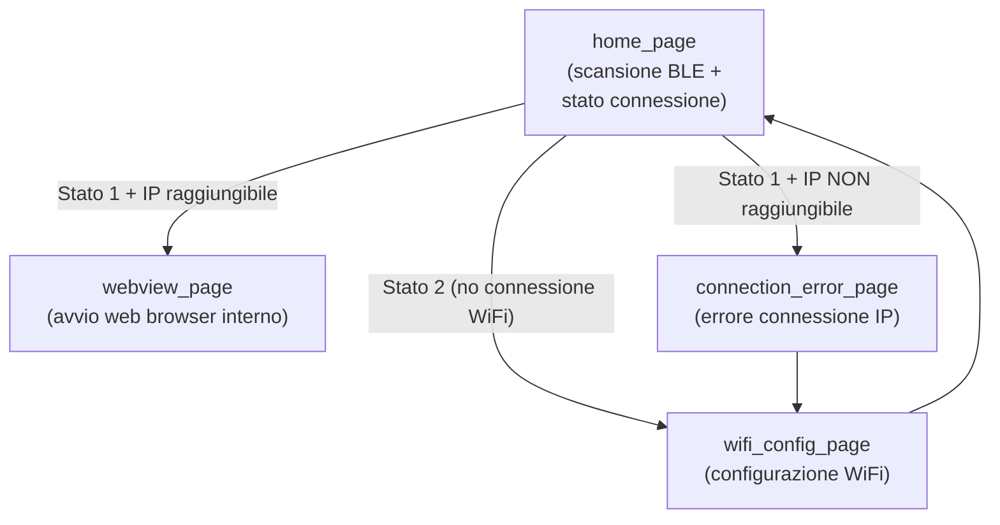

# Pagine flutter

## **Pagine**

**1. `home_page.dart` – Pagina iniziale e gestione connessione BLE**

**Ruolo**:\
Questa è la schermata principale dell’app. Si occupa della scansione dei dispositivi BLE e gestisce il flusso logico iniziale in base allo stato di connessione del dispositivo.

**Funzionalità principali**:

* Scansione dispositivi BLE.
* Connessione al dispositivo selezionato.
* Richiesta dello stato della connessione WiFi del Raspberry (tramite BLE).
* In base allo stato, reindirizza verso:
  * `webview_page`: se la connessione WiFi del Raspberry  è attiva e l’indirizzo IP è raggiungibile.
  * `wifi_config_page`: se la connessione WiFi del Raspberry  non è attiva&#x20;
  * `connection_error_page`: se la connessione WiFi del Raspberry  è attiva ma l’indirizzo IP non è raggiungibile.

***

**2. `wifi_config_page.dart` – Configurazione WiFi del dispositivo**

**Ruolo**:\
Permette all’utente di configurare tramite BLE la rete WiFi a cui deve connettersi il Raspberry.

**Funzionalità principali**:

* Elenco reti WiFi visibili.
* Inserimento credenziali (SSID e password).
* Invio delle credenziali al Raspberry tramite BLE.
* Attesa del nuovo stato di connessione.

***

**3. `connection_error_page.dart` – Gestione errori di connessione IP**

**Ruolo**:\
Mostrata quando lo stato di connessione è attivo (`stato 1`) ma l’indirizzo IP fornito non è raggiungibile.

**Funzionalità principali**:

* Mostra messaggio di errore.
* Tre opzioni per l’utente:
  1. **Riprova**: riavvia il controllo dello stato di connessione.
  2. **Apri impostazioni WiFi del telefono**: aiuta a verificare se il telefono è sulla stessa rete del dispositivo.
  3. **Riconfigura WiFi del dispositivo**: reindirizza a `wifi_config_page`.

***

**4. `webview_page.dart` – Interfaccia web del dispositivo**

**Ruolo**:\
Se la connessione IP ha successo, l’app carica il pannello web del dispositivo all’interno di un `WebView`.

**Funzionalità principali**:

* Caricamento URL ricevuto dal dispositivo (es. `http://192.168.1.42`).
* Navigazione all’interno della UI remota del Raspberry.
* Controlli nativi limitati; l’interazione avviene via web.

## Schema delle Pagine

#### Descrizione flussi

* **Stato 0**: il Raspberry si sta ancora connettendo → l’utente resta su `home_page` finché cambia lo stato.
* **Stato 1**:
  * Se l’IP è raggiungibile → `webview_page`
  * Se l’IP **non** è raggiungibile → `connection_error_page`
* **Stato 2**: viene mostrata la `wifi_config_page` per configurare il WiFi.
* Da `connection_error_page` l’utente può accedere alla `wifi_config_page`.
* Dopo aver configurato il WiFi, si torna a `home_page` per ricontrollare.
