# Schema Hardware

## Componenti principali

* Raspberry Pi 4B con Ubuntu Server
* BLE (Bluetooth Low Energy) integrato
* Access Point Wi-Fi gestito via hostapd
* Connessione a reti Wi-Fi esistenti
* Smartphone Android con app Flutter

## Diagramma Hardware (Mermaid)

```mermaid
graph TD
  Phone["📱 Smartphone (App Flutter)"]
  BLE["📶 BLE (Bluetooth Low Energy)"]
  RPI["🖥️ Raspberry Pi 4B"]
  WiFi["🌐 Wi-Fi Network"]
  Hotspot["📡 Hotspot (Access Point)"]

  Phone -->|BLE Connessione| BLE
  BLE --> RPI
  RPI -->|Client| WiFi
  RPI -->|AP Mode| Hotspot
```

