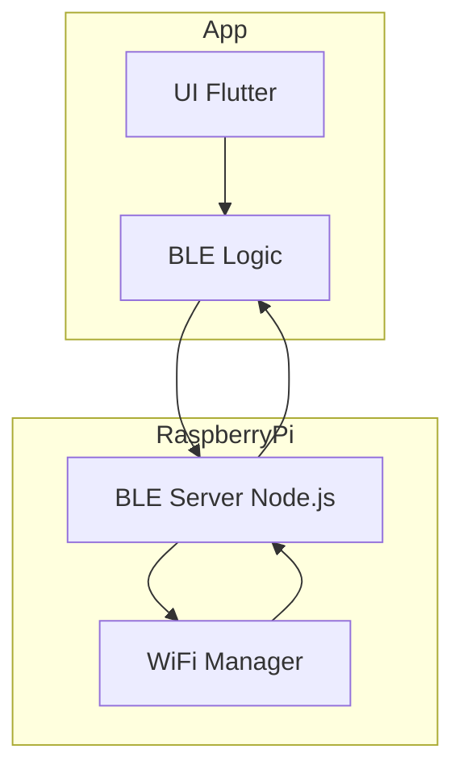

# Schema Software

## Blocchi principali

* **App Flutter**: interfaccia utente e gestione BLE
* **BLE Server su Raspberry Pi**: espone caratteristiche BLE
* **Gestione Wi-Fi**: attivazione hotspot o connessione Wi-Fi tramite `nmcli`

## Flusso informativo

```mermaid
flowchart TD
  subgraph App
    UI[UI Flutter]
    Logic[BLE Logic]
  end

  subgraph RaspberryPi
    BLE_Server[BLE Server (Node.js)]
    WiFi_Manager[WiFi Manager (nmcli)]
  end

  UI --> Logic
  Logic --BLE--> BLE_Server
  BLE_Server --> WiFi_Manager
  WiFi_Manager --> BLE_Server
  BLE_Server --BLE--> Logic
```


